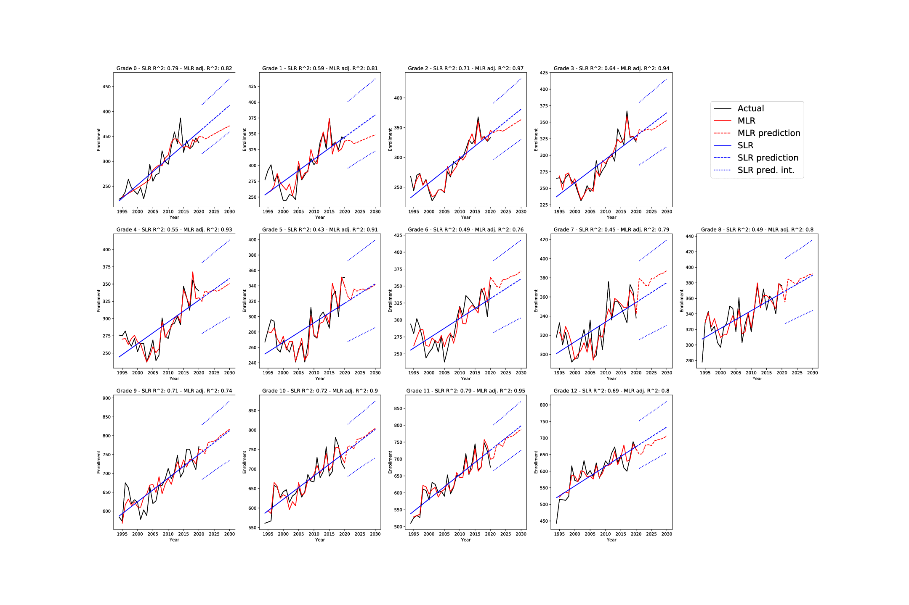
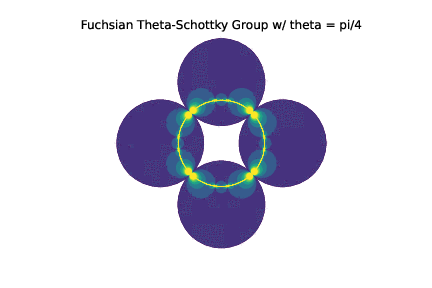
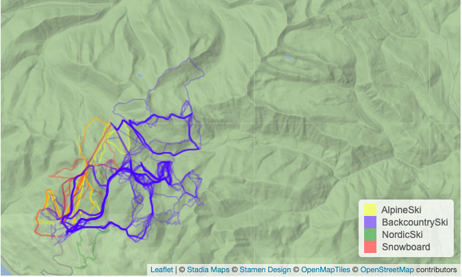

## About

I'm an assistant professor of math at [Flathead Valley Community College](https://www.fvcc.edu). I primarily teach intro statistics and the courses feeding into this class, but my background is in low-dimensional topology. Back in the day I thought about 3-manifolds and the character varieties thereof, but lately I've pivoted towards thinking about data analysis, data science, and machine learning.  

In 2022 I started working part-time as a data analyst for FVCC. This role involves performing in-depth statistical analyses, developing and maintaining Tableau dashboards, ETL and automation projects related to IR and IT, and fulfilling adhoc data requests. I interact with a wide variety of stakeholders across campus, from faculty to the financial aid and business offices to the executive team, and leverage my experience as en educator to clearly communicate technical results to all parties.

To see more about my background, check out my current [resume](./assets/resume.pdf) or an older CV. For more information on the projects listed in my resume, see the 'Professional - data' project link below.

The rest of this pages gives links to some teaching resources and some professional and personal projects.

### Teaching resources

- [STAT216](./stat216): Find here a playlist of videos I made for FVCC's online intro stats class, notes on using R for basic inferential statistics, and an educational widget or two. 

- [M115](./m115): Find here links to books we use in this course, Desmos, and other class resources. 

### Projects

- [Professional - data](./professional)

- [Professional - mathematics](./math)

- [Personal Data Projects](./personal)

